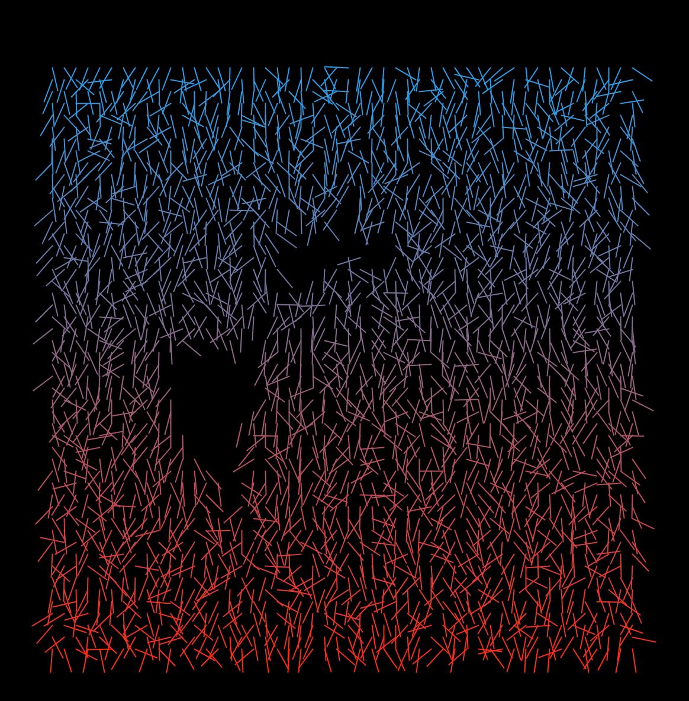
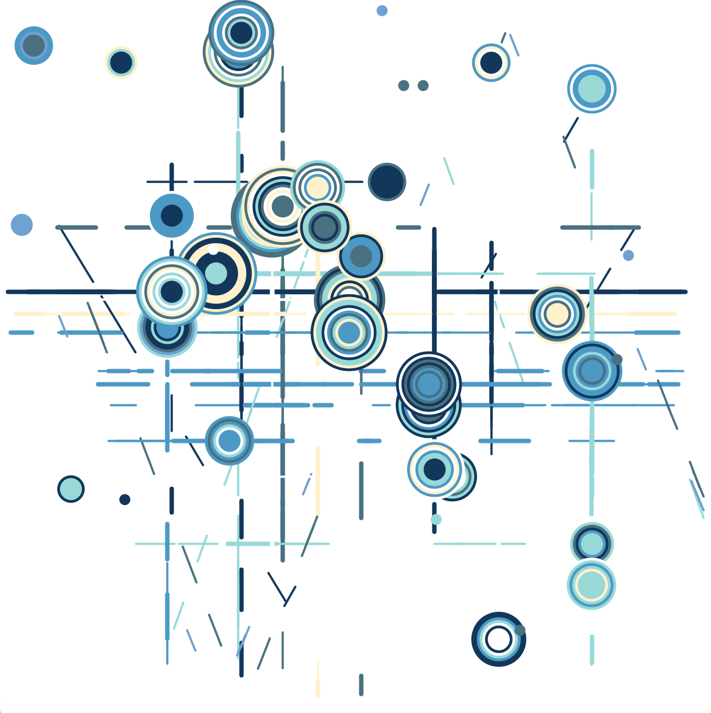
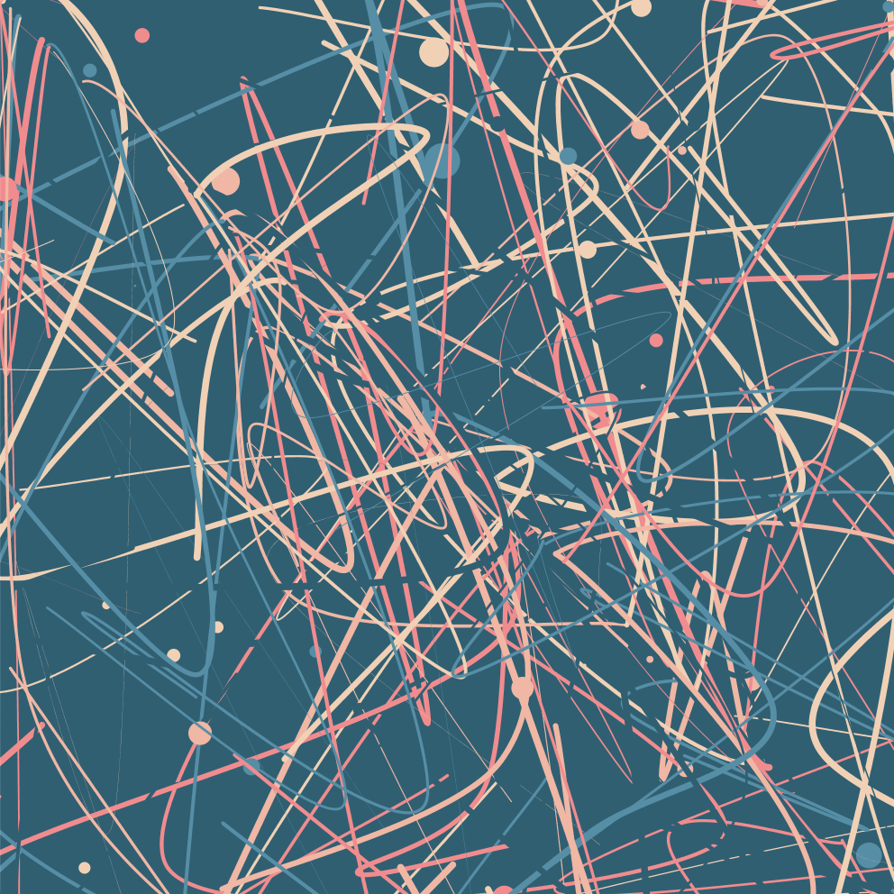
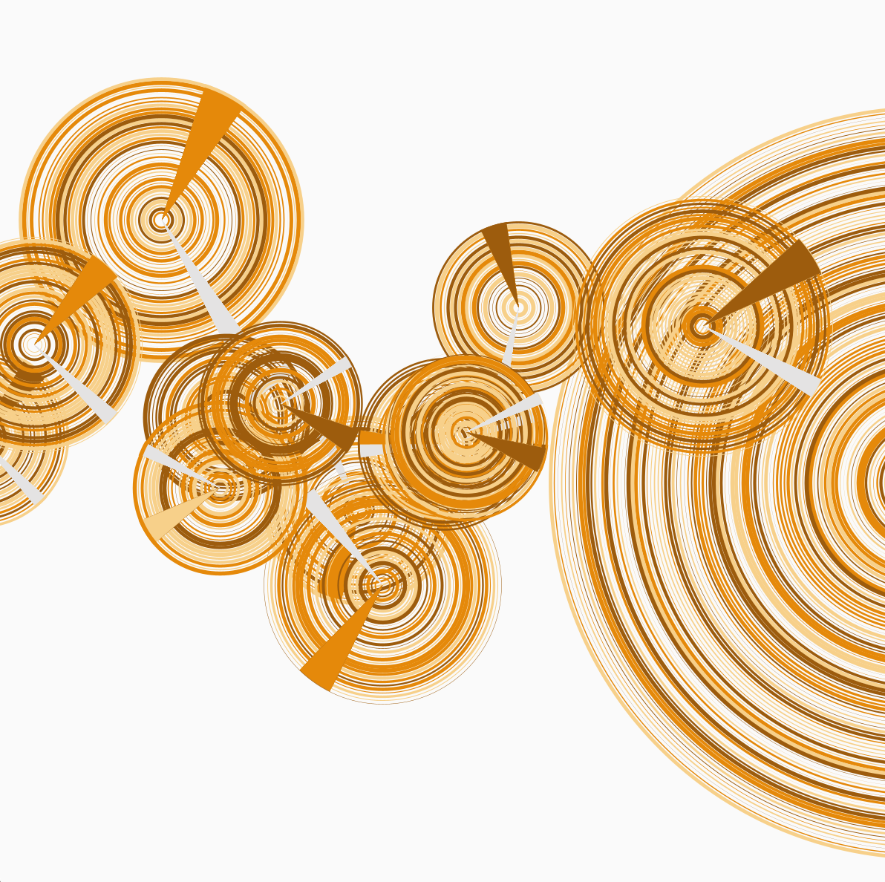
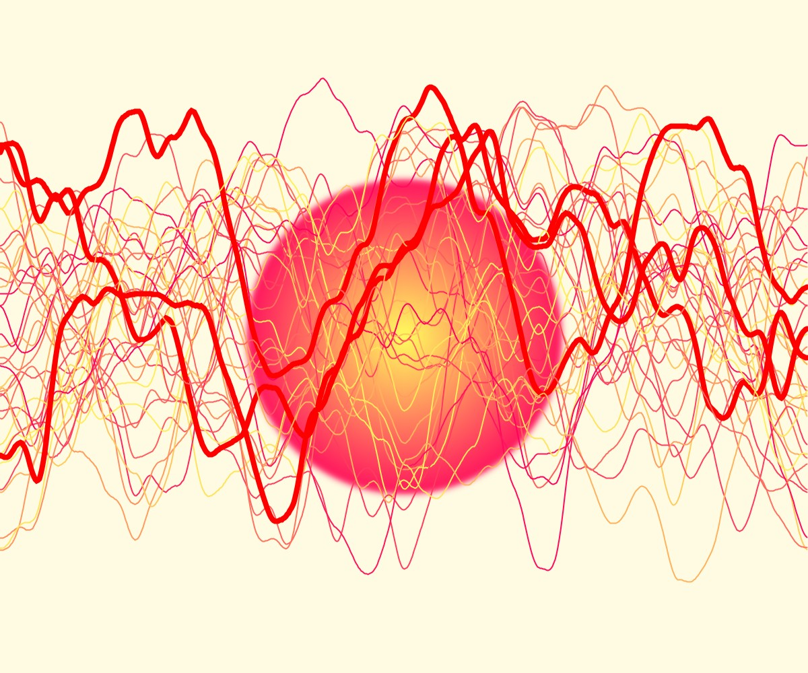

# Coding Generative Art 
This is a collection of creative coding projects I've made, most of which are computer generated art pieces derived from a certain algorithm.
To run the sketches, you will need to download [Processing](https://processing.org/).

Here is an index: 

| Name      | Image |
| ----------- | ----------- |
| Interruption      |        |
| Rabin-Karp Search Generated Animation   |   |
| Sampling (Poisson-Disk)  |  |      
| Simulted Annealing Generated Circles  | |
| Iris-KNN (based on the classical Iris Dataset with the KNN algorithm) | |

